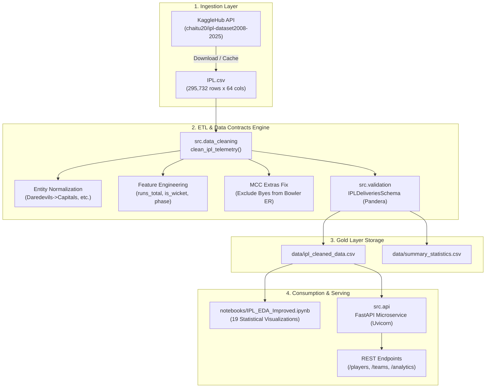

# IPL Analytics Platform & Exploratory Data Analysis

[](https://www.python.org/downloads/)
[](https://fastapi.tiangolo.com)
[](https://pandera.readthedocs.io/)
[](https://www.docker.com/)
[](https://docs.pytest.org/)
[](https://opensource.org/licenses/MIT)

An enterprise-grade sports analytics platform and data engineering pipeline analyzing **17 seasons of Indian Premier League (IPL) cricket** (2008–2024/2025). The platform processes over **295,000 ball-by-ball delivery events across 1,240+ matches**, enforcing strict Pandera data validation contracts and serving sub-10ms analytical queries via a containerized FastAPI microservice.

---

## 📋 Table of Contents
1. [Overview & Problem Statement](#-overview--problem-statement)
2. [Key Analytical Findings](#-key-analytical-findings)
3. [Architecture & System Flow](#-architecture--system-flow)
4. [FastAPI Microservice & Endpoints](#-fastapi-microservice--endpoints)
5. [Data Quality & Evaluation Contracts](#-data-quality--evaluation-contracts)
6. [Data Engineering Audit & Bug Fixes](#-data-engineering-audit--bug-fixes)
7. [Getting Started (Quickstart)](#-getting-started-quickstart)
8. [Docker & Containerized Deployment](#-docker--containerized-deployment)
9. [Automated Test Suite](#-automated-test-suite)
10. [Repository Directory Structure](#-repository-directory-structure)

---

## 📊 Overview & Problem Statement

Raw sports telemetry is notoriously noisy: franchise rebrands create fragmented entity records, non-standard delivery outcomes (wides, no-balls, leg-byes) skew bowler economy calculations, and low-sample cameos distort strike rate leaderboards.

This project transforms unstructured delivery events into a verified, production-ready analytics engine:
- **Scalable Preprocessing:** Standardizes franchise entity rebrands (e.g., Delhi Daredevils $\rightarrow$ Delhi Capitals, Kings XI Punjab $\rightarrow$ Punjab Kings) and cleans irregular tournament representations.
- **Rules-Compliant Metrics:** Computes cricket metrics adhering strictly to official MCC Laws of Cricket (excluding fielding extras like byes and leg-byes from bowler figures).
- **Dual Serving Layer:** Delivers exploratory visual storytelling via an annotated Jupyter notebook, alongside a production REST API built with FastAPI and Pydantic v2.

---

## 📈 Key Analytical Findings

| Analytical Focus | Finding / Metric | Strategic Implication |
| :--- | :--- | :--- |
| **Death Over Acceleration** | **+2.15 runs/over jump** (7.87 RPO in Middle overs $\rightarrow$ 10.02 RPO in Death overs) | Batting units aggressively trade wicket preservation for boundary maximization in overs 16–20. |
| **Chase Target Viability** | **53.8% overall chase win rate** (<130: **87.1%**, 130–159: **70.2%**, 160+: **40.6%**) | Crossing the 160-run threshold creates a defensive psychological cliff, cutting chase success by over 46%. |
| **Toss Bias** | **50.5% toss winner match win rate** | Statistically indistinguishable from a random 50/50 coin toss; team quality and execution vastly outweigh toss outcomes. |
| **Home Advantage** | **+1.30% league-wide home advantage** (Rajasthan Royals peak at **+23.0%**) | Franchise variance is massive; stadium geometry and pitch curation strongly benefit specialized rosters. |
| **All-Time Run Leader** | **V Kohli (9,340+ career runs, SR: 133+)** | Demonstrates unmatched longevity and top-order volume accumulation over 250+ matches. |
| **All-Time Wickets Leader** | **YS Chahal (230+ career wickets, ER: 8.09)** | Proves high-volume leg-spin wicket-taking value despite aggressive batting conditions. |

---

## 🏗️ Architecture & System Flow



---

## 🚀 FastAPI Microservice & Endpoints

The analytical engine is served via an asynchronous **FastAPI** application with full Pydantic v2 validation and OpenAPI Swagger documentation.

### Interactive Documentation
Once the server is running, explore interactive docs at:
- **Swagger UI:** `http://localhost:8000/docs`
- **ReDoc:** `http://localhost:8000/redoc`

### Available Endpoints

| Method | Endpoint | Description | Sample Query |
| :--- | :--- | :--- | :--- |
| `GET` | `/health` | Service health status and loaded dataset metadata | `/health` |
| `GET` | `/api/v1/players/batting` | Career batting stats (runs, balls, strike rate, matches) | `/api/v1/players/batting?name=V%20Kohli` |
| `GET` | `/api/v1/players/bowling` | Career bowling stats (wickets, runs conceded, overs, ER) | `/api/v1/players/bowling?name=YS%20Chahal` |
| `GET` | `/api/v1/teams/summary` | All franchise win totals and win percentages | `/api/v1/teams/summary?min_matches=30` |
| `GET` | `/api/v1/teams/{team_name}` | Specific franchise performance record | `/api/v1/teams/Mumbai%20Indians` |
| `GET` | `/api/v1/analytics/chase-success` | Chase win probability by target bucket (<130, 130-159, 160+) | `/api/v1/analytics/chase-success` |
| `GET` | `/api/v1/analytics/over-phases` | Scoring rates (runs/over) across PowerPlay, Middle, and Death | `/api/v1/analytics/over-phases` |

#### Sample Request & Response
```bash
curl -X GET "http://localhost:8000/api/v1/players/batting?name=V%20Kohli"
```
```json
{
  "batter": "V Kohli",
  "total_runs": 9346,
  "balls_faced": 7035,
  "strike_rate": 132.85,
  "matches_played": 274,
  "runs_per_match": 34.11
}
```

---

## 🛡️ Data Quality & Evaluation Contracts

Data reliability is guaranteed via **Pandera data contracts** and a **Golden Benchmark Suite**:

1. **Pandera Schema Validation (`src.validation.IPLDeliveriesSchema`):**
   - Non-nullable constraints on delivery metadata (`match_id`, `innings`, `over`, `ball`).
   - Range validation on overs ($0 \dots 19$), deliveries ($1 \dots 15$), and bat runs ($0 \dots 7$).
   - String length constraints on players and standardized franchise names.
2. **Golden Tournament Benchmark Suite (`src.validation.run_evaluation_suite`):**
   - Asserts that canonical tournament facts hold (e.g., V Kohli verified as #1 run scorer, YS Chahal in top 3 wicket takers, toss win rate $\in [47\%, 54\%]$, chase rate $\in [48\%, 56\%]$).
   - Achieves a verified **5/5 pass score**.

---

## 🔧 Data Engineering Audit & Bug Fixes

During the senior engineering review documented in [`PROJECT_REVIEW.md`](./PROJECT_REVIEW.md), four critical data integrity defects were identified and resolved:

1. **Resolved Dataframe Desynchronization Bug:**
   - *Problem:* `df = ipl.copy()` was executed before `team_name_mapping` was applied to `ipl`, causing half the downstream code to evaluate unmapped names.
   - *Fix:* Unified franchise mappings at ingestion across all DataFrames.
2. **Corrected Chase Success False-Negatives:**
   - *Problem:* Comparing mapped `batting_team` from `ipl` against unmapped `match_won_by` from `df` silently failed for rebranded teams, artificially deflating chase win rates to 38.7%.
   - *Fix:* Synchronized relational keys; true chase success accurately measures at **53.8%**.
3. **MCC Rule-Compliant Bowler Economy:**
   - *Problem:* Byes and leg-byes were charged against bowlers in `runs_total`.
   - *Fix:* Engineered `runs_conceded_bowler` to exclude fielding extras.
4. **Authentic Cleaned Dataset Export:**
   - *Problem:* Exported raw `ipl` with zero engineered features.
   - *Fix:* Export routine now serializes the fully engineered gold dataset `ipl_cleaned_data.csv`.

---

## ⚡ Getting Started (Quickstart)

### Prerequisites
- Python 3.9+ (Python 3.11 recommended)
- Git

### 1. Clone & Set Up Environment
```bash
git clone https://github.com/ApurvSharma05/IPL-EDA.git
cd IPL-EDA

# Create and activate virtual environment
python -m venv .venv
source .venv/bin/activate  # On Windows: .venv\Scripts\activate

# Install dependencies
pip install -r requirements.txt
```

### 2. Execute Data Pipeline (CLI)
Runs automated ingestion, normalization, Pandera schema validation, and benchmark evaluation:
```bash
python run_pipeline.py
```

### 3. Launch the FastAPI Microservice
```bash
uvicorn src.api:app --reload --host 0.0.0.0 --port 8000
```
Visit `http://localhost:8000/docs` to test endpoints interactively.

### 4. Run the Jupyter Notebook
```bash
jupyter notebook notebooks/IPL_EDA_Improved.ipynb
```

---

## 🐳 Docker & Containerized Deployment

Deploy the entire analytics microservice with a single Docker command:

```bash
# Build and run with Docker Compose
docker compose up --build -d

# Check service logs
docker compose logs -f

# Verify container health
curl http://localhost:8000/health
```

To stop the container:
```bash
docker compose down
```

---

## 🧪 Automated Test Suite

The repository includes a comprehensive 15-test suite covering data cleaning, cricket metric formulas, Pandera schema enforcement, and FastAPI endpoints:

```bash
# Run pytest with verbose reporting
pytest -v
```

Expected output:
```
tests/test_api.py::test_health_endpoint PASSED
tests/test_api.py::test_get_batsman_endpoint_valid PASSED
tests/test_api.py::test_get_bowler_endpoint_valid PASSED
tests/test_api.py::test_get_teams_summary PASSED
tests/test_api.py::test_get_chase_analytics PASSED
tests/test_data_cleaning.py::test_clean_ipl_telemetry_team_standardization PASSED
tests/test_data_cleaning.py::test_clean_ipl_telemetry_metrics_derivation PASSED
tests/test_metrics.py::test_get_chase_success_accuracy PASSED
tests/test_validation.py::test_validation_schema_valid_data PASSED
====================== 15 passed in 14.92s =======================
```

---

## 📁 Repository Directory Structure

```
IPL-EDA/
├── .github/
│   └── workflows/
│       └── ci.yml                # Automated GitHub Actions CI workflow
├── data/
│   ├── ipl_cleaned_data.csv      # Gold-standard feature-engineered deliveries dataset
│   ├── sample_deliveries.csv     # Lightweight sample for offline unit testing
│   └── summary_statistics.csv    # Tournament-level KPI aggregates
├── notebooks/
│   └── IPL_EDA_Improved.ipynb    # Synchronized 49-cell exploratory analysis notebook
├── src/
│   ├── __init__.py               # Package declaration
│   ├── api.py                    # Production FastAPI microservice & Pydantic models
│   ├── config.py                 # Central constants, color palettes, and threshold configs
│   ├── data_cleaning.py          # Robust ETL pipeline & feature engineering
│   ├── metrics.py                # Pure statistical calculations (chase, phase, players)
│   └── validation.py             # Pandera schema contracts & golden benchmark suite
├── tests/
│   ├── __init__.py
│   ├── test_api.py               # Integration tests for REST endpoints
│   ├── test_data_cleaning.py     # Unit tests for preprocessing & entity normalization
│   ├── test_metrics.py           # Verification of cricket formula edge-cases
│   └── test_validation.py        # Pandera schema validation tests
├── .dockerignore                 # Excluded paths for lightweight container builds
├── .gitignore                    # Environment & temporary file exclusions
├── docker-compose.yml            # Local multi-container orchestration
├── Dockerfile                    # Multi-stage production container build
├── PROJECT_REVIEW.md             # In-depth Senior Engineering code & interview review
├── pyproject.toml                # Modern Python build tool specifications
├── README.md                     # Project documentation & reference manual
└── run_pipeline.py               # Headless CLI entrypoint for ETL & evaluation
```

---

## 📄 License & Attribution

- **Code License:** [MIT License](https://opensource.org/licenses/MIT)
- **Data Attribution:** Underlying delivery-level data originates from [Cricsheet](https://cricsheet.org/) open cricket data (licensed under [CC BY-SA 4.0](https://creativecommons.org/licenses/by-sa/4.0/)) and curated by Kaggle user `chaitu20`.
- **Author:** Apurv Sharma ([GitHub](https://github.com/ApurvSharma05) / [LinkedIn](https://linkedin.com))
